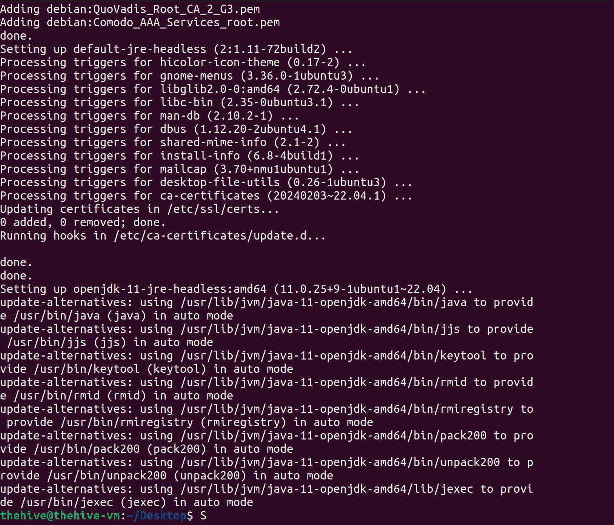
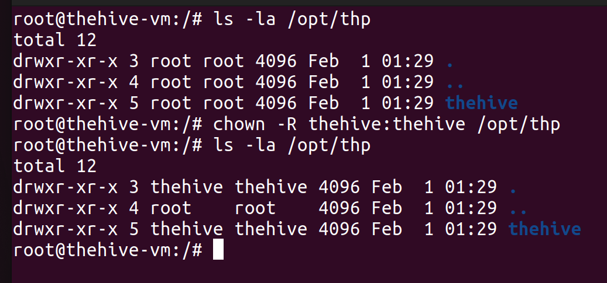
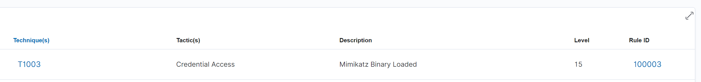

# SOC automation LAB
## 1. Introduction
### 1.1 Overview
SOC Automation Lab là một dự án tập trung vào tự động hóa Security Operations Center (SOC) bằng cách sử dụng các công cụ mã nguồn mở như Wazuh, Shuffle, và TheHive. Mục tiêu chính là giảm bớt gánh nặng cho các SOC analyst, cải thiện tốc độ phản hồi sự cố và tối ưu hóa quy trình giám sát bảo mật.
Các thành phần chính:

  - Windows 10 + Sysmon → Tạo log bảo mật và sự kiện.
  - Wazuh → Thu thập, phân tích, và cảnh báo sự kiện bảo mật.
  - Shuffle → Tự động hóa quy trình xử lý cảnh báo bảo mật.
  - TheHive → Quản lý sự cố và phối hợp phản hồi bảo mật.
  - VirusTotal → Kiểm tra file và URL nghi ngờ có chứa mã độc.


## 2. Requirements
Các công cụ cần cài đặt:

- VMware Workstation/Fusion → Tạo máy ảo.
- Windows 10 → Máy tạo log & mô phỏng hoạt động của user.
- Ubuntu 22.04 → Hệ điều hành để chạy Wazuh & TheHive.
- Sysmon → Thu thập log hệ thống chi tiết trên Windows.
## 3. Installation
### 3.1 Cấu hình win 10 với sysmon
#### 3.1.1 Cài đặt Sysmon
Check sysmon đã cài đặt chưa
Service
Event Viewer -> Application and Services Logs -> Microsoft -> Windows -> Sysmon -> Operational

Download và cài đặt Sysmon từ [Microsoft Sysinternals](https://docs.microsoft.com/en-us/sysinternals/downloads/sysmon).
Download cấu hình Sysmon từ [sysmon-modular](https://github.com/olafhartong/sysmon-modular/blob/master/sysmonconfig.xml).

Run PowerShell với quyền Admin và điều hướng đến thư mục chứa Sysmon.


Thực hiện lệnh sau để cài đặt Sysmon:
``` .\Sysmon64.exe -i .\sysmonconfig.xml ```


Kiểm tra Sysmon đã cài đặt thành công:


## 3.2 Cài đặt Wazuh
### 3.2.1 Cài đặt Wazuh
Download và cài đặt Wazuh Agent từ [Wazuh](https://documentation.wazuh.com/current/installation-guide/installing-wazuh-agent/wazuh_agent_windows.html).
CHạy lệnh sau để cài đặt Wazuh Agent:
``` curl -sO https://packages.wazuh.com/4.7/wazuh-install.sh && sudo bash ./wazuh-install.sh -a ```


Thông tin đăng nhập vào Wazuh:
```
    User: admin
    Password: jvBwKy.h8l4*CQFiDYBtoBcz2t*6lQ*o
```


Cấu hình thành công wazuh server

## 3.3 Cài đặt TheHive
### 3.3.1 Cài đặt các gói phụ thuộc
chạy lệnh:
``` apt install wget gnupg apt-transport-https git ca-certificates ca-certificates-java curl software-properties-common python3-pip lsb-release ```


### 3.3.2 Cài đặt java
chạy các lệnh sau:
``` 
wget -qO- https://apt.corretto.aws/corretto.key | sudo gpg --dearmor -o /usr/share/keyrings/corretto.gpg
echo "deb [signed-by=/usr/share/keyrings/corretto.gpg] https://apt.corretto.aws stable main" | sudo tee -a /etc/apt/sources.list.d/corretto.sources.list
sudo apt update
sudo apt install java-common java-11-amazon-corretto-jdk
echo JAVA_HOME="/usr/lib/jvm/java-11-amazon-corretto" | sudo tee -a /etc/environment
export JAVA_HOME="/usr/lib/jvm/java-11-amazon-corretto" 
```


### 3.3.3 Cài đặt Apache Cassandra
Chạy các lệnh sau:
```
wget -qO -  https://downloads.apache.org/cassandra/KEYS | sudo gpg --dearmor  -o /usr/share/keyrings/cassandra-archive.gpg
echo "deb [signed-by=/usr/share/keyrings/cassandra-archive.gpg] https://debian.cassandra.apache.org 40x main" |  sudo tee -a /etc/apt/sources.list.d/cassandra.sources.list
sudo apt update
sudo apt install cassandra
```
### 3.3.4 Cài đặt Elasticsearch
Chạy các lệnh sau:
```
wget -qO - https://artifacts.elastic.co/GPG-KEY-elasticsearch | sudo gpg --dearmor -o /usr/share/keyrings/elasticsearch-keyring.gpg
sudo apt-get install apt-transport-https
echo "deb [signed-by=/usr/share/keyrings/elasticsearch-keyring.gpg] https://artifacts.elastic.co/packages/7.x/apt stable main" | sudo tee /etc/apt/sources.list.d/elastic-7.x.list
sudo apt update
sudo apt install elasticsearch
```


### 3.3.5 Cài đặt TheHive
Chạy các lệnh sau:
```
wget -O- https://archives.strangebee.com/keys/strangebee.gpg | sudo gpg --dearmor -o /usr/share/keyrings/strangebee-archive-keyring.gpg
echo 'deb [signed-by=/usr/share/keyrings/strangebee-archive-keyring.gpg] https://deb.strangebee.com thehive-5.2 main' | sudo tee -a /etc/apt/sources.list.d/strangebee.list
sudo apt-get update
sudo apt-get install -y thehive
```

### 3.4 Cấu hình TheHive và Wazuh
#### 3.4.1 Cấu hình Cassandra
Sửa đổi tệp cấu hình cassandra.yaml:
``` nano /etc/cassandra/cassandra.yaml ```


Đổi địa chỉ ip của listen_address thành


Đổi seed_provider thành


Dừng dịch vụ cassandra:
``` systemctl stop cassandra.service ```

Xóa dữ liệu cũ:
``` rm -rf /var/lib/cassandra/data/* ```

Khởi động lại dịch vụ cassandra:
``` systemctl start cassandra.service ```


#### 3.4.2 Cấu hình Elasticsearch
Cấu hình bằng cách sửa tệp 
``` nano /etc/elasticsearch/elasticsearch.yml ```

Bỏ chú thích cluster.name và node.name. Bỏ chú thích network.host và đặt giá trị là IP của máy chủ.


Khởi động dịch vụ Elasticsearch:
``` 
systemctl start elasticsearch
systemctl enable elasticsearch
```
Kiểm tra trạng thái của Elasticsearch:
``` systemctl status elasticsearch ```


#### 3.4.3 Cấu hình TheHive
Kiểm tra quyền truy cập của user hive:




Bây giờ thay đổi tệp cấu hình TheHive:
``` nano /etc/thehive/application.conf ```


Khởi động dịch vụ TheHive:
```
systemctl start thehive
systemctl enable thehive
```


check 
```
systemctl status cassandra
systemctl status elasticsearch
systemctl status thehive
```


Thông tin đăng nhập vào TheHive:
```
Username: admin@thehive.local
Password: secret
```


### 3.5 Cấu hình Wazuh 
#### 3.5.1 thêm Windows Agent vào Wazuh
Truy cập vào Wazuh -> Configuration -> Add Agent


Trên windows agent, chạy lệnh được cung cấp để thêm agent vào Wazuh


#### 3.5.2 Xác minh trên wazuh
Truy cập vào Wazuh -> Agents -> Windows Agent


## 4. Tạo thông tin cảnh báo
### 4.1 Cấu hình chuyển tiếp sự kiện từ sysmon đến Wazuh
#### 4.1.1 Cấu hình Sysmon
Truy cập vào ```C:\Program Files (x86)\ossec-agent``` sau đó mở file ```ossec.conf``` và thêm dòng sau:

Thêm chuyển tiếp sự kiện Sysmon vào Wazuh
``` 
<localfile>
    <location>Microsoft-Windows-Sysmon/Operational</location>
    <log_format>eventchannel</log_format>
</localfile> 
```
### 4.2 Tạo dữ liệu từ xa MimiKatz
#### 4.2.1 Cài đặt Mimikatz

#### 4.2.2 Chạy Mimikatz

#### 4.2.3 Cấu hình Wazuh ghi lại các sự kiện
Truy cập vào ```/var/ossec/etc/ossec.conf``` và sửa:


Sau đó khởi động lại Wazuh:
``` systemctl restart wazuh-manager.service ```

#### 4.2.4 Cấu hình filebeat
Truy cập vào ```/etc/filebeat/filebeat.yml``` và sửa enable: true


Khởi động lại filebeat:
``` systemctl restart filebeat ```

#### 4.2.5 Tạo chỉ mục mới trong Wazuh


Chọn Create index pattern


Chọn Next step và chọn 'timestamp'


Về lại Wazuh và chọn Discover sau đó chọn index mới tạo


#### 4.2.6 Khởi chạy MimiKatz
Chạy MimiKatz trên Windows và kiểm tra sysmon đã ghi lại sự kiện chưa

Kiểm tra trên log Wazuh


### 4.3 Tạo cảnh báo tùy chỉnh trên Wazuh
#### 4.3.1 Phân tích nhật ký MimiKatz
Kiểm tra các sự kiện MimiKatz trên Wazuh và tìm trường phù hợp để cảnh báo. Ví dụ sử dụng ```originalFileName```


Sử dụng trường này đảm bảo cảnh báo vẫn xuất hiện ngay cả khi tên file thực thi bị thay đổi

#### 4.3.2 Tạo quy tắc cảnh báo
Có thể thực hiện qua giao diện hoặc CLI


Chọn ```manager rule file``` sau đó lọc sysmon


Đây là rule mẫu để cảnh báo khi có sự kiện tham khảo và thực hiện tùy chỉnh


Thực hiện chọn ```Custom rule``` và chọn ```local_rules.xml```
Thêm vào rule mới
```
<rule id="100002" level="15">
  <if_group>sysmon_event1</if_group>
  <field name="win.eventdata.originalFileName" type="pcre2">(?i)\\mimikatz\.exe</field>
  <description>Mimikatz Usage Detected</description>
  <mitre>
    <id>T1003</id>
  </mitre>
</rule>
```
Lưu tệp và khởi động lại Wazuh
``` systemctl restart wazuh-manager.service ```


#### 4.3.3 Kiểm tra cảnh báo
Chạy Mimikatz trên Windows và kiểm tra cảnh báo trên Wazuh




## 5. Tự động hóa với Shuffle và TheHive  
### 5.1 Thiêt lập Shuffle
#### 5.1.1 Tạo tài khoản Shuffle
#### 5.1.2 Tạo quy trình làm việc mới
#### 5.1.3 Thêm webhook trigger


``` https://shuffler.io/api/v1/hooks/webhook_b4225542-e407-45c5-870d-cdce77e12664```

#### 5.1.4 Cấu hình Change Me


#### 5.1.5 Cấu hình wazuh để kết nối tới shuffler
Sửa đổi ossec.conf
```nano /var/ossec/etc/ossec.conf```

Thêm 
```
<integration>
  <name>shuffle</name>
  <hook_url>https://shuffler.io/api/v1/hooks/webhook_b4225542-e407-45c5-870d-cd>
  <rule_id>100002</rule_id>
  <alert_format>json</alert_format>
</integration>
```
Khởi động lại dịch vụ wazuh ```systemctl restart wazuh-manager.service```

#### 5.1.6 Kiểm tra việc kết nối Shuffle
Trong shuffle chọn Wazuh-Alerts và chọn start


Chạy mimikatz trên Windows và kiểm tra kết quả trên Shuffle


Cảnh báo được gửi từ Wazuh đến Shuffle

### 5.2 Xây dựng quy trình làm việc
Các bước thực hiện:
1. Cảnh báo về việc sử dụng Mimikatz gửi từ Wazuh đến Shuffle
2. Shuffle nhận được cảnh báo trích xuất SHA256 từ tệp
3. Kiểm tra SHA256 trên VirusTotal
4. Gửi thông tin từ VirusTotal lên TheHive
5. Gửi email thông báo 

#### 5.2.1 Trích xuất băm SHA256 từ cảnh báo
Chọn Received -> chọn "Regex capture group" thay vì "Repeat back to me". Trong input data chọn tùy chọn hashes. Trong tab regex, nhập mẫu regex SHA256=([0-9A-Fa-f]{64}). Chọn Save.


Click run sau đó click show previous workflow runs (man running icon) đê xem kết quả


#### 5.2.2 Kiểm tra SHA256 trên VirusTotal
Tạo tài khoản VirusTotal và lấy API key
Trong Shuffle vào App -> VirusTotal -> Add
Chọn VirusTotal nhập API key và chọn "Authenticate"


Trong trường id chọn Received và chọn list


Save và chạy lại


#### 5.2.3 Gửi thông tin từ VirusTotal lên TheHive
Trong Shuffle vào App -> TheHive -> Add
#### 5.2.4 Cấu hình TheHive
Tạo mới organisation và user


Đặt mật khẩu và tạo API key
zN1ODz2vYXAvY/4gCi8ALy4qTeOhI/aL


Khóa API key được dùng để xác thực trong Shuffle. Giờ đăng nhập bằng user vừa tạo

#### 5.2.5 Cấu hình Shuffle
Chọn Thehive -> Chọn Authenticate thehive -> nhập thông tin và chọn Authenticate


ỏ "Find action" chọn "Create alert"
Fomat Json cho thehive nhận canh báo
``` json
{
  "description": "Mimikatz Detected on host: DESKTOP-HS8N3J7",
  "externallink": "",
  "flag": false,
  "pap": 2,
  "severity": "2",
  "source": "Wazuh",
  "sourceRef": "Rule:100002",
  "status": "New",
  "summary": "Details about the Mimikatz detection",
  "tags": [
    "T1003"
  ],
  "title": "Mimikatz Detection Alert",
  "tlp": 2,
  "type": "Internal"
}
```
Chọn advance và nhập vào phần body


bổ sung thêm các trường để thêm chi tiết cảnh báo


#### 5.2.6 Gửi thông báo qua email
Chọn App -> Email -> Add


